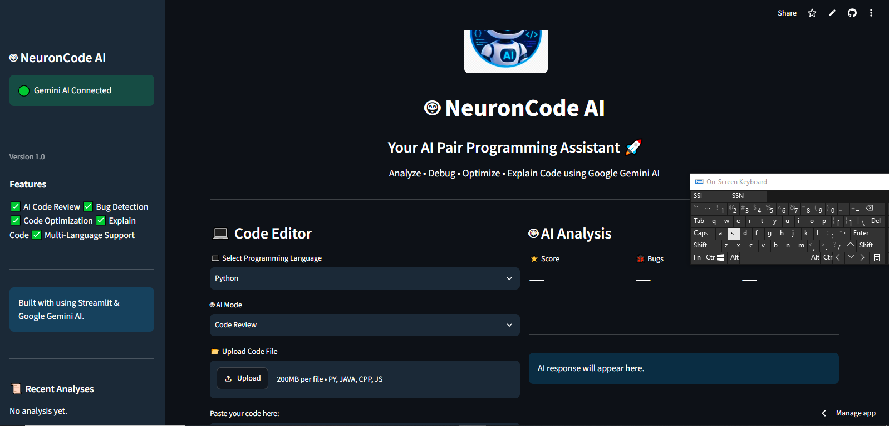

🤖 NeuronCode AI
NeuronCode AI is an AI-powered code assistant built with Streamlit + Python + Google Gemini.

It helps you:

✅ Review code
✅ Detect bugs
✅ Optimize code
✅ Explain code
✅ Work with multiple languages
🚀 Live Demo
(Add your deployed app link here later)

📸 Preview

🛠️ Tech Stack
Python
Streamlit
Google Gemini API
📦 Installation
git clone https://github.com/areej-fatimah/NeuronCode-AI.git
cd <your-project-folder>
pip install -r requirements.txt
streamlit run app.py
📁 Project Structure
NeuronCode-AI/
│── app.py
│── utils.py
│── logo.png
│── requirements.txt
│── README.md
👩‍💻 Author
Made by Areej